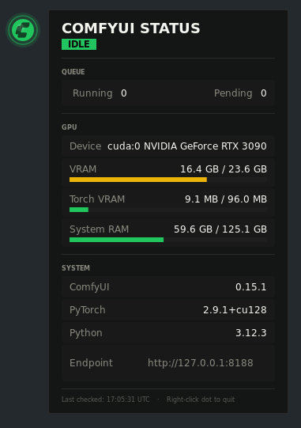

<p align="center">
  
</p>

<p align="center">
  <strong>ShinyWidgets</strong> — ComfyUI Status Checker
</p>

<p align="center">
  <em>Real-time desktop widgets for your creative pipeline</em>
</p>

<p align="center">
  
  
  
  
</p>

---

A lightweight, always-on-top desktop status indicator for **ComfyUI** instances. Shows a floating circular dot that reflects real-time queue state, with toast notifications for generation progress and a detailed hover panel displaying GPU/VRAM usage, queue depth, and system info.

> **Part of the [ShinyWidgets](https://github.com/ShAInyXYZ) series** — small, focused desktop widgets that let you know what's happening in your software and pipeline at a glance. Zero clutter, zero noise, just the info you need.

---

<p align="center">
  
</p>

## What It Does

| Dot Color | Meaning |
|:-:|---|
| **Green** | Idle — ready to generate |
| **Blue** (spinning arc) | Actively generating |
| **Yellow** | Jobs queued and waiting |
| **Grey** | ComfyUI offline / unreachable |
| **Red** | Error |

## Features

- **Floating status dot** — transparent circular indicator with pulsing glow, always on top
- **Live toast notifications** — real-time alerts that pop up next to the dot:
  - Generation started / completed
  - Step-by-step progress (`Step 12/20 (60%)`) via websocket
  - ComfyUI online / offline transitions
  - Queue status changes
- **Hover panel** — detailed breakdown:
  - Queue status (running / pending — side by side)
  - GPU device name
  - VRAM usage with color-coded progress bar
  - Torch VRAM allocation
  - System RAM usage
  - ComfyUI version, PyTorch version, Python version
  - Clickable endpoint URL (click to change)
- **Configurable endpoint** — `--host` and `--port` flags (default: `127.0.0.1:8188`)
- **Fast polling** — HTTP every 2s + websocket for instant progress updates
- **Draggable** — click and drag to reposition anywhere on screen
- **Multi-monitor aware** — `~` key cycles through left/right sides of every connected display
- **Cross-platform** — auto-detects Linux / Windows and adjusts window hints
- **Zero pip dependencies** — uses only Python standard library + system GTK3


## Requirements

- Python 3.8+
- GTK3 with GObject Introspection
- Compositing window manager (for RGBA transparency)
- A running ComfyUI instance

The app **auto-detects your platform** at startup and adjusts accordingly. If GTK3 is missing, it prints platform-specific installation instructions.

<details>
<summary><strong>Linux</strong></summary>

GTK3 is pre-installed on most Linux desktops. If not:

**Debian / Ubuntu:**
```bash
sudo apt install python3-gi python3-gi-cairo gir1.2-gtk-3.0
```

**Fedora:**
```bash
sudo dnf install python3-gobject gtk3
```

**Arch:**
```bash
sudo pacman -S python-gobject gtk3
```

> **Note:** If you use conda/pyenv/virtualenv, the system `python3-gi` package may not be visible. Run with `/usr/bin/python3` or create a venv with `--system-site-packages`.

</details>

<details>
<summary><strong>Windows</strong></summary>

GTK3 is not bundled with Windows. Two options:

**Option A: MSYS2 (recommended)**

1. Install [MSYS2](https://www.msys2.org/)
2. Open the **MSYS2 UCRT64** terminal and run:
   ```bash
   pacman -S mingw-w64-ucrt-x86_64-python-gobject mingw-w64-ucrt-x86_64-gtk3
   ```
3. Run the script using the MSYS2 Python:
   ```bash
   /ucrt64/bin/python3 comfyui-status-checker.py
   ```

**Option B: pip + GTK3 Runtime**

1. Install the [GTK3 Runtime for Windows](https://github.com/tschoonj/GTK-for-Windows-Runtime-Environment-Installer/releases) and make sure it's on your `PATH`
2. Install PyGObject via pip:
   ```bash
   pip install PyGObject
   ```
3. Run normally:
   ```bash
   python comfyui-status-checker.py
   ```

> RGBA transparency requires Windows 7+ with desktop composition enabled (default on modern Windows).

</details>

## Usage

```bash
# Default — monitors 127.0.0.1:8188
./comfyui-status-checker.py

# Custom host/port (e.g. remote machine or NAS)
./comfyui-status-checker.py --host 192.168.1.100 --port 8188

# With system python (recommended if using conda/pyenv)
/usr/bin/python3 comfyui-status-checker.py --host my-gpu-server --port 8188
```

### Controls

| Action | Effect |
|---|---|
| **Hover** | Opens the status detail panel |
| **Click** | Change the ComfyUI endpoint (host/port) |
| **Click + Drag** | Repositions the dot |
| **`~` key** | Cycles all ShinyWidgets through screen sides (left/right, all monitors) |
| **Right-click** | Quits the application |

### Desktop Entry (Linux)

```bash
cat > ~/.local/share/applications/comfyui-status-checker.desktop << 'EOF'
[Desktop Entry]
Name=ShinyWidgets — ComfyUI Status
Comment=Always-on-top ComfyUI instance status indicator
Exec=/usr/bin/python3 /path/to/comfyui-status-checker.py
Icon=network-transmit-receive
Type=Application
Categories=Utility;
StartupNotify=false
EOF
```

To autostart on login:
```bash
cp ~/.local/share/applications/comfyui-status-checker.desktop ~/.config/autostart/
```

## Widget Coordination

ShinyWidgets are designed to work together. Running multiple widgets (e.g. ComfyUI + Claude) side by side? Press **`~`** on **any** widget and they all move together, stacked vertically with a 50px gap, cycling through the left and right edges of every connected monitor.

The coordination works via a shared directory (`~/.config/status-widgets/`):
- Each widget registers itself with a JSON file on startup
- A shared `corner.json` stores the current position index
- All widgets poll this file 5 times/sec and reposition when it changes
- Stale registrations (dead PIDs) are automatically cleaned up

## How It Works

**Polling** — the app hits two ComfyUI API endpoints every 2 seconds:

| Endpoint | Data |
|---|---|
| `GET /queue` | Running and pending job counts — determines dot state |
| `GET /system_stats` | GPU name, VRAM, RAM, versions |

**Websocket** — a persistent connection to `ws://host:port/ws` receives real-time generation progress:

| Message Type | Usage |
|---|---|
| `progress` | Step X/Y updates shown as live toast notifications |
| `executing` (node=null) | Generation complete — dismisses progress toast |

**State logic:**
- `queue_running > 0` → **Generating** (blue, spinning arc)
- `queue_pending > 0` → **Queued** (yellow)
- Both zero → **Idle** (green)
- Connection failed → **Offline** (grey)

The dot window uses GTK3 with Cairo drawing on an RGBA visual for true pixel-level transparency — no visible window frame or background.

## ShinyWidgets Family

| Widget | Monitors | Repo |
|---|---|---|
| **ComfyUI Status** | ComfyUI generation queue, GPU/VRAM, progress | *you are here* |
| **Claude Status** | Anthropic API health, service status, incidents | [claude-status-checker](https://github.com/ShAInyXYZ/claude-status-checker) |
| *more coming...* | | |

> ShinyWidgets are small, single-purpose desktop indicators designed to keep you informed about the tools you depend on — without getting in the way. Each one is a single Python file with zero pip dependencies.

---

<p align="center">
  Made by <strong><a href="https://github.com/ShAInyXYZ">ShAInyXYZ</a></strong>
  <br />
  MIT License
</p>
